# Instagram Influencer Verification System

## Overview

> **Disclaimer:**
>
> ❗️ **NDA Protected:** This repository **DOES NOT** contain source code or runnable binaries due to Non-Disclosure Agreements with the client.
>
> ❗️ **Academic Context:** This project was developed as a Capstone Software Project at the University of Melbourne, in collaboration with Dr. Brent Coker.
>
> ❗️ **Status:** The system is a production-ready prototype delivered to the client for future integration.

We developed an **AI-driven Instagram Influencer Verification System** for **Wear Cape**. Designed to integrate seamlessly into the influencer registration workflow, this tool automates the assessment of account performance, generating a comprehensive quality score (0–100) and identifying potential red flags. By leveraging advanced LLMs and heuristic analysis, it provides actionable AI insights, significantly streamlining the vetting process for admin users.

## The Problem

With the booming creator economy, brands and influencers need a reliable platform to connect and collaborate. **Wear Cape** was built to bridge this gap.

However, a critical bottleneck remained: **Verification**.

* **Data Scarcity:** Official Instagram APIs are restrictive and difficult to obtain for startups.
* **Manual Bottleneck:** Admins had to manually verify screenshots and metrics for every applicant.
* **Inefficiency:** The manual review process was estimated to take **30+ minutes per application**, making scaling impossible.

## The Solution

Our team engineered a **secure, scalable, and automated AI pipeline**. The system extracts performance data from user-uploaded screenshots via OCR, analyzes it against heuristic rules, and uses LLMs to provide search-grounded, real-life context.

**Impact:** Reduced verification time from **~30 minutes** to **< 2 minutes** per application, achieving a **15x efficiency gain**.

## My Contributions (Tech Lead)

As the **Technical Lead**, I orchestrated the end-to-end development lifecycle, from architectural design to final deployment, contributing **~75% of the production codebase**.

### System Architecture & Design

* **Microservices Architecture:** Architected a decoupled system separating the Frontend, Backend, and ML services to ensure independent scalability.
* **Data Integrity:** Designed a robust Database Schema (Prisma/SQLite) featuring a **Snapshot Pattern** to preserve historical applicant data against updates.
* **Security Protocols:** Established comprehensive security standards for authentication (JWT), file uploads, and API communications to mitigate OWASP Top 10 vulnerabilities.

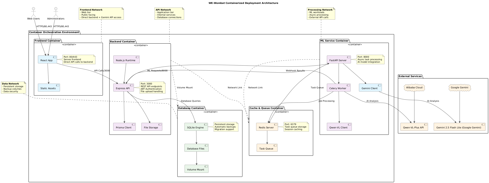

### Backend Engineering (Node.js + Express)

* **Core Infrastructure:** Built the RESTful API backbone using **Node.js, Express, and TypeScript**, ensuring type safety and maintainability.
* **Secure Authentication:** Implemented a stateless authentication system using JWT with strict CORS policies and rate limiting to prevent Broken Access Control.
* **Async Processing:** Engineered a webhook-based communication layer to handle long-running ML inference tasks asynchronously.
* **ORM Integration:** Utilized **Prisma** for efficient database queries and migrations.

### AI & Machine Learning Infrastructure

* **Scalable ML Pipeline:** Engineered the ML service using **Python (FastAPI)**.
* **Distributed Task Queue:** Implemented **Celery + Redis** to manage asynchronous inference tasks, preventing request timeouts and ensuring system responsiveness under load.
* **LLM Integration:** Integrated **Qwen-VL-Plus** and **Gemini** models for "Deep Dive" analysis.
* **Prompt Engineering:** Refined prompts to minimize hallucination and maximize information density in generated influencer reports.
  

### Frontend Development (React + TypeScript)

* **Interactive UI:** Developed the "AI Deep Dive" interface and real-time status visualizations using **React 18**.
* **Data Visualization:** Implemented dynamic charts to render influencer metrics and engagement trends.
* **State Management:** Consolidated complex frontend logic to handle asynchronous data fetching and real-time updates from the backend.
  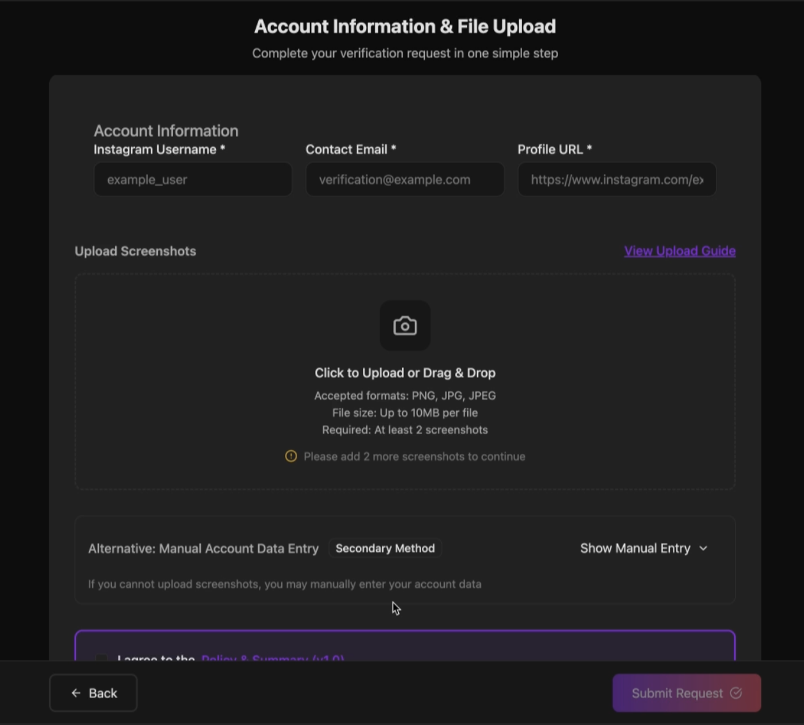
  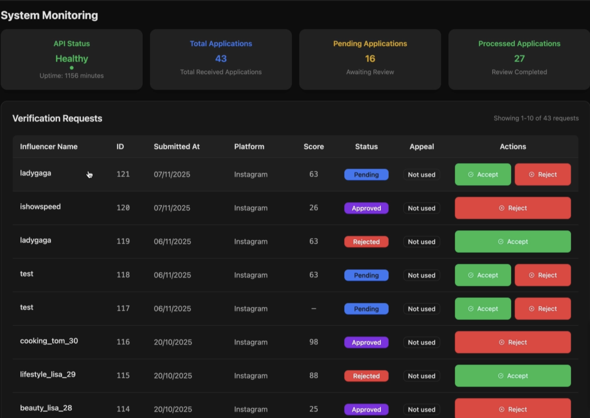
  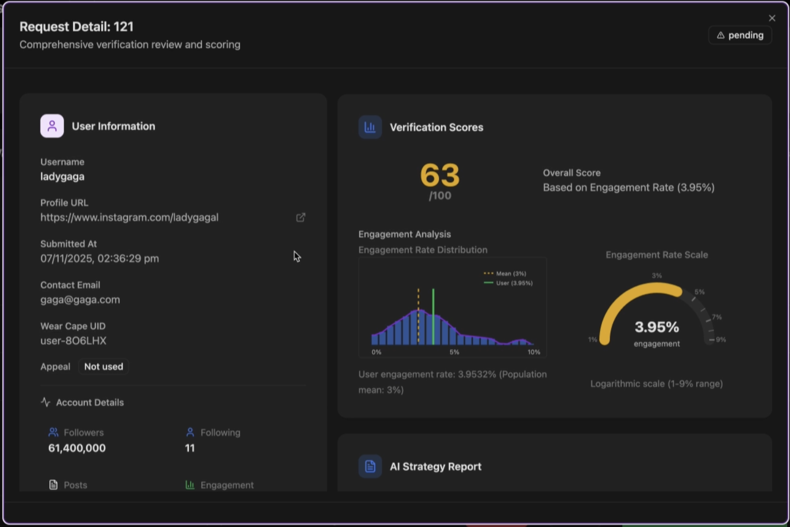

### DevOps, CI/CD & Observability

* **Containerization:** Dockerized the entire stack (Frontend, Backend, ML Service, Workers, Redis) using **Docker Compose** for consistent deployment across environments.
* **Full Observability Stack:** Deployed a complete monitoring solution using **Prometheus** (metrics), **Grafana** (visualization), **Loki** (logs), and **Promtail**, ensuring production-grade visibility.
* **Automated Testing:** Established a rigorous testing culture with **Jest**. Achieved **>85% statement coverage** (1018/1195 statements) with 778+ test cases.
* **CI/CD Pipelines:** Configured GitHub Actions for automated testing, linting, and build verification.
  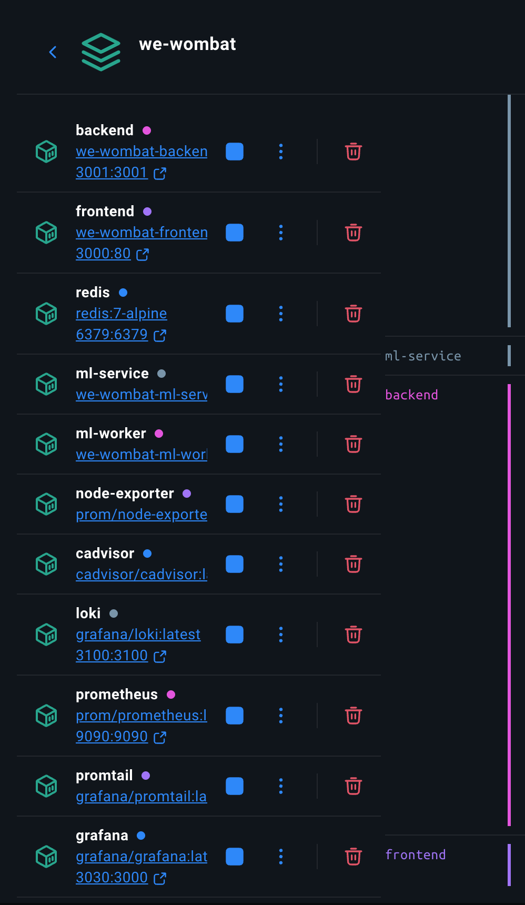
  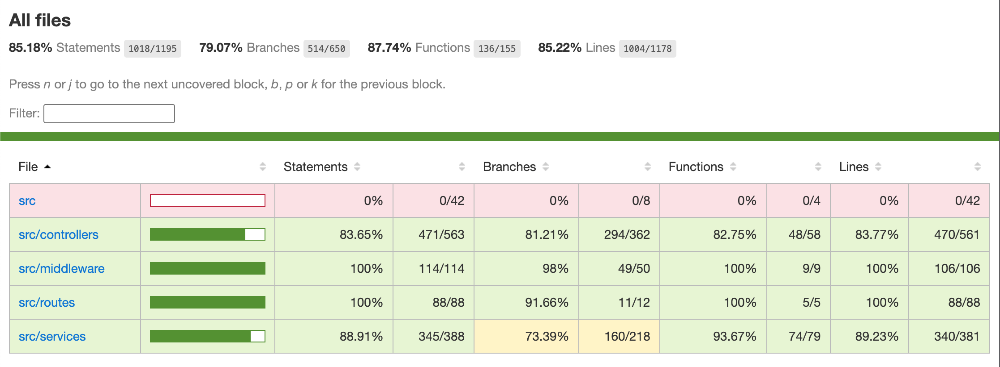
  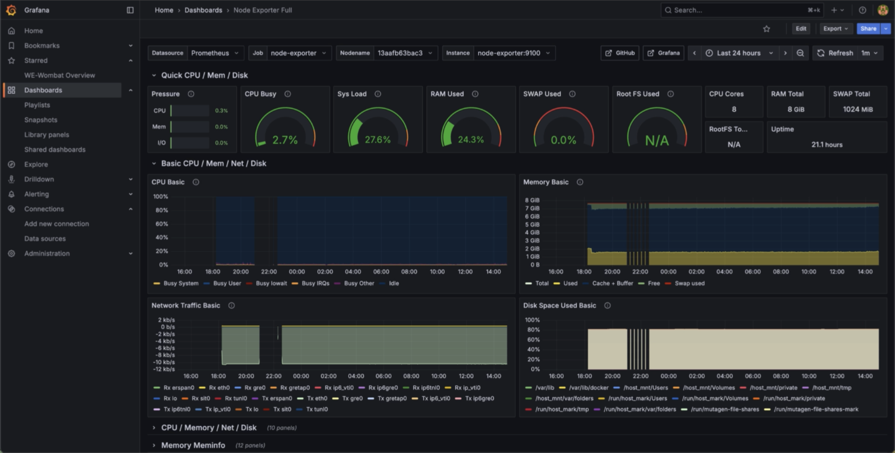

### Agile Leadership

* **Technical Direction:** Bridged the gap between client business requirements and technical feasibility.
* **Sprint Management:** Managed task dependencies and technical debt, ensuring the team delivered a production-ready MVP despite tight deadlines.
* **Code Quality:** Enforced strict code review standards and Git workflows to maintain codebase health.

## Development Logs

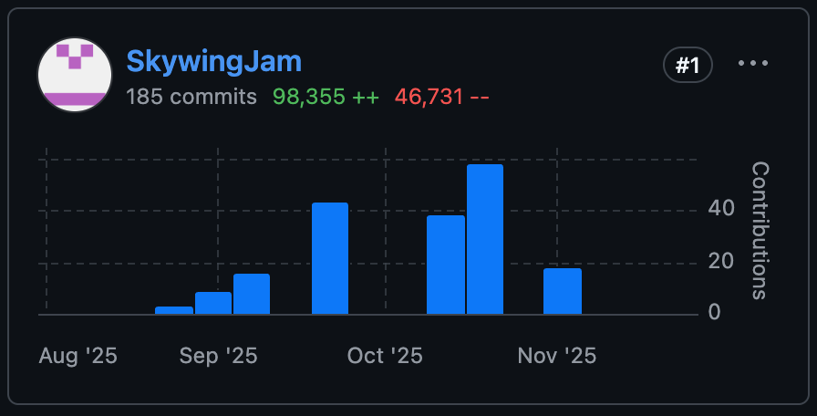
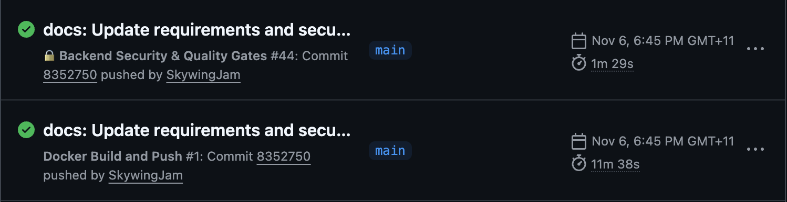

## Outcome

The system received high praise from both the University teaching team and the client for its architectural maturity and completeness.

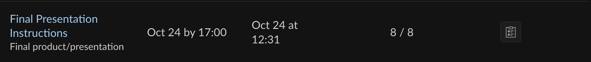
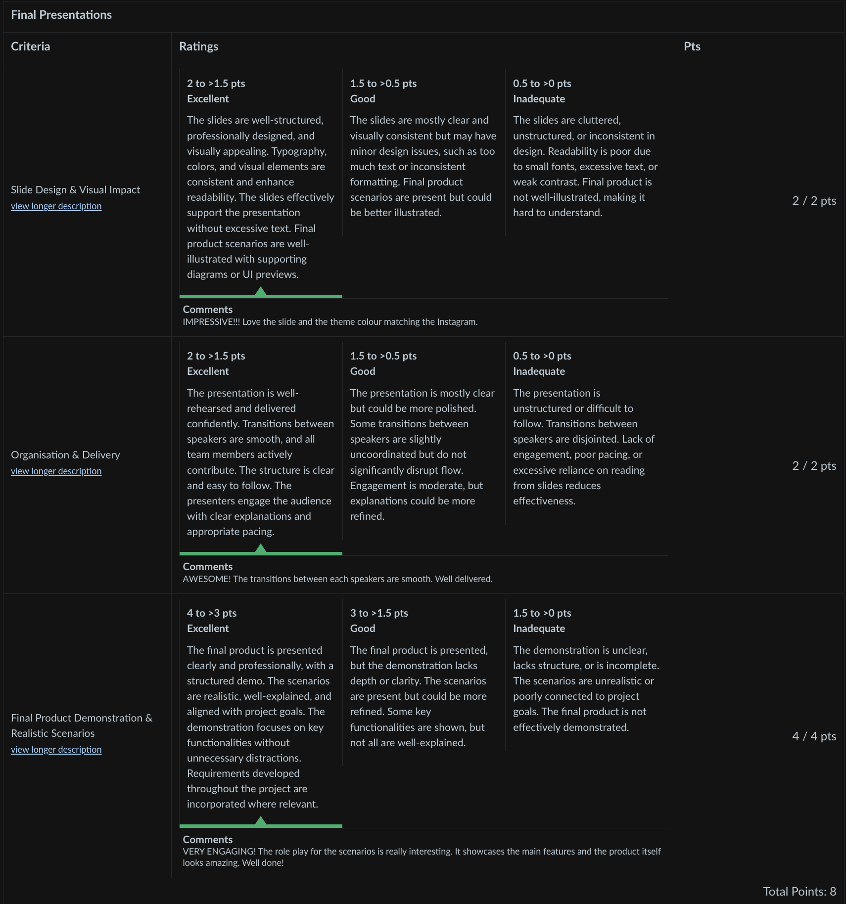

You can check out the final presentation recording here (Link to YouTube), I'm the last speaker:

## Tech Stack

* **Frontend:** React, TypeScript, Vite, TailwindCSS
* **Backend:** Node.js, Express, Prisma, SQLite
* **ML/AI:** Python, FastAPI, Celery, Redis, Qwen-VL/Gemini
* **DevOps:** Docker, GitHub Actions, Prometheus, Grafana, Loki

## License & Copyright

**All Rights Reserved. © 2025 Deloosh Pty Ltd.**

This project is the intellectual property of Deloosh Pty Ltd. (Wear Cape). Unauthorized use, reproduction, or distribution is strictly prohibited.

## Credits

Special thanks to **Dr. Brent Coker** (Client), **Dr. Michael Fu** (Supervisor), and **Mr. Jim Hsiao** (Tutor) for their continuous support.
